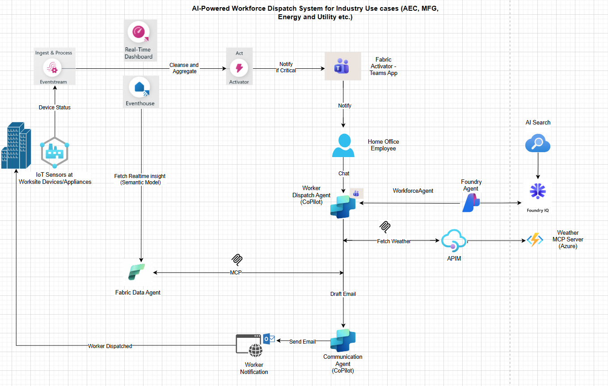

# AEC Industry Agent - Workforce Dispatch Assistant

An Azure AI Foundry Prompt Agent that helps construction site managers with **workforce dispatch** and **skill finding** using Foundry IQ as a knowledge base. The agent retrieves workforce details, skills, certifications, and availability to assist in matching the right workers to job sites.

## Use Case

In the **Architecture, Engineering & Construction (AEC)** industry, dispatching the right workforce to construction sites is critical. This agent helps:

- 🔍 **Find workers by skill** - Search for workers with specific certifications (e.g., crane operators, electricians)
- 📋 **Check availability** - Query worker schedules and availability for dispatch
- 🏗️ **Site assignment** - Get recommendations for workforce allocation based on project needs
- 📊 **Compliance tracking** - Verify worker certifications and training status

## Solution Design



The full solution integrates multiple components:

| Component | Description |
|-----------|-------------|
| **IoT Sensors** | Worksite devices sending real-time status to Microsoft Fabric |
| **Microsoft Fabric** | Eventstream, Eventhouse, Real-Time Dashboard, and Activator for event processing |
| **Worker Dispatch Agent** | Central Copilot orchestrator that coordinates workforce dispatch |
| **Foundry Agent** | Queries Foundry IQ (Azure AI Search) for workforce skills and availability |
| **Fabric Data Agent** | Fetches real-time device insights via Microsoft Fabric Data Agent for NL2SQL queries |
| **Weather MCP Server** | External weather data service accessed via Azure API Management |
| **Communication Agent** | Drafts and sends notifications via Outlook to dispatched workers |

**Flow:**
1. IoT sensors stream device status → Fabric Eventstream → Eventhouse → Dashboard
2. Critical events trigger Fabric Activator → Teams notification to Home Office
3. Employee chats with Worker Dispatch Agent to find available workforce
4. Agent orchestrates: workforce lookup + real-time device data + weather conditions
5. Communication Agent drafts email → Worker Notification sent
6. Worker dispatched to worksite

## Components

1. **Knowledge Base Creation** - Script to create Azure AI Search index with blob storage as document source
2. **Foundry IQ MCP Connection** - Connects the agent to Azure AI Search knowledge base via MCP protocol
3. **Prompt Agent** - A Foundry-hosted agent with instructions to query the workforce knowledge base
4. **Client Application** - Interactive Python client to chat with the agent

## Prerequisites

- Python 3.10+
- Azure CLI installed and authenticated
- Access to Azure AI Foundry with a project
- Azure AI Search resource (with agentic retrieval support)
- Azure Blob Storage with workforce documents (PDF, DOCX, etc.)
- Azure OpenAI with embedding model deployed (e.g., text-embedding-3-large)
- Microsoft Fabric workspace with a published Fabric Data Agent (for real-time data queries)

## Quick Start

### 1. Clone and Setup

```bash
# Clone the repository
git clone https://github.com/pdas-codespace/IndustryAgents-AEC-WorkforceDispatch.git
cd IndustryAgents-AEC-WorkforceDispatch

# Create virtual environment
python -m venv .venv
.venv\Scripts\activate  # Windows
# source .venv/bin/activate  # Linux/Mac

# Install dependencies
pip install -r requirements.txt

# Copy and configure environment variables
cp .env.example .env
# Edit .env with your Azure resource details
```

### 2. Configure Environment Variables

Edit `.env` with your Azure resource details:

```env
# Azure AI Foundry Project
AZURE_AI_PROJECT_ENDPOINT=https://<your-foundry-account>.services.ai.azure.com/api/projects/<project>
AZURE_AI_PROJECT_RESOURCE_ID=/subscriptions/<sub>/resourceGroups/<rg>/providers/Microsoft.CognitiveServices/accounts/<account>/projects/<project>

# Model Configuration
AZURE_AI_MODEL_DEPLOYMENT_NAME=gpt-4o

# Foundry IQ Knowledge Base (Azure AI Search)
FOUNDRY_KNOWLEDGE_BASE_MCP_URL=https://<ai-search>.search.windows.net/knowledgebases/<kb-id>/mcp?api-version=2025-11-01-preview
MCP_TOOL_CONNECTION_NAME=<your-connection-name>
AI_SEARCH_API_KEY=<your-ai-search-api-key>

# Agent Names
PROMPT_AGENT_NAME=WorkforceDispatchAgent

# Microsoft Fabric Data Agent (Optional - for real-time data queries)
FABRIC_PROJECT_CONNECTION_NAME=<your-fabric-connection-name>
FABRIC_AGENT_NAME=FabricDataAgent
```

### 3. Create the Foundry IQ MCP Connection

This creates a connection between your Foundry project and the Azure AI Search knowledge base:

```bash
python scripts/setup/createFoundryIQMCPConnection.py
```

### 4. Create the Prompt Agent

This registers the Prompt Agent with Foundry IQ as its knowledge tool:

```bash
python scripts/setup/createPromptAgentWithFoundryIQ.py
```

### 5. Chat with the Agent

Start an interactive session to ask questions about your workforce:

```bash
python scripts/clients/callPromptAgent.py
```

## Microsoft Fabric Data Agent Integration (Optional)

The Fabric Data Agent enables natural language queries over enterprise data stored in Microsoft Fabric. This is useful for real-time device data, IoT sensor readings, and structured business data.

### Prerequisites for Fabric Integration

1. **Create a Fabric Data Agent** in Microsoft Fabric ([documentation](https://go.microsoft.com/fwlink/?linkid=2312910))
2. **Publish the Fabric Data Agent** to make it available
3. **Create a connection** in your Foundry project to the Fabric Data Agent
4. **Assign permissions**:
   - Developers and end users need `Azure AI User` RBAC role
   - Users need at least `READ` access to the Fabric Data Agent and its underlying data sources
5. Ensure the Fabric Data Agent and Foundry project are in the **same tenant**

### Configure Environment Variables for Fabric

Add these to your `.env`:

```env
# Microsoft Fabric Data Agent
FABRIC_PROJECT_CONNECTION_NAME=<your-fabric-connection-name>
FABRIC_AGENT_NAME=FabricDataAgent
```

### Create the Fabric Agent

```bash
python scripts/setup/createPromptAgentWithFabric.py
```

### Chat with the Fabric Agent

```bash
python scripts/clients/callFabricAgent.py
```

### Fabric Agent Usage Examples

```
You: Are there any active critical device alerts across any of our work sites?

Agent: Based on the real-time data from Fabric, here are the active critical alerts:
- Site NYC-01: Crane sensor offline (Critical)
- Site CHI-03: Temperature threshold exceeded on excavator
- Site LA-02: Equipment maintenance overdue
...
```

```
You: Any alerts in the PA site?

Agent: According to the device data for Pennsylvania sites:
- PA-Site-01: 2 active alerts (1 warning, 1 informational)
- PA-Site-02: No active alerts
- PA-Site-03: 1 critical alert - Safety harness sensor disconnected
...
```

```
You: What kind of alerts are visible when it comes to worker safety?

Agent: Here are the worker safety-related alerts across all sites:
- Hard hat compliance violations: 3 incidents today
- Restricted zone breaches: 2 active warnings
- Safety equipment sensor failures: 5 devices need attention
- Heat stress warnings: 4 workers flagged in high-temp zones
...
```

## Weather Agent Integration (Optional)

The Weather Agent uses an MCP-based weather tool to provide weather-aware safety instructions for construction workers. It can help generate dispatch notes with appropriate safety gear recommendations based on current and forecasted weather conditions.

For the full implementation of a Foundry Hosted Agent with MCP Tools (including the Weather Tool), see: [Foundry-Hosted-Agent-With-MCP-Tools](https://github.com/pdas-codespace/Foundry-Hosted-Agent-With-MCP-Tools)

### Weather Agent Usage Examples

```
You: There is a Crane failure in our PA site. Please help me write a dispatch note for John Doe.

Agent: **DISPATCH NOTE**

**To:** John Doe  
**Site:** PA-Site-01  
**Issue:** Crane Failure - Immediate Response Required

**Current Weather Conditions (PA Site):**
- Temperature: 45°F (7°C)
- Conditions: Overcast with light rain expected
- Wind: 12 mph gusting to 18 mph

**Required Safety Gear:**
- High-visibility rain jacket
- Insulated work gloves
- Non-slip safety boots
- Hard hat with rain cover
- Safety harness for elevated work

**Weather Alert:** Light rain forecasted for the next 4 hours. 
Exercise caution on wet surfaces during crane inspection.

**Assignment:** Assess crane malfunction and report findings.
**Priority:** High
...
```

```
You: What safety gear should workers wear at the Chicago site today?

Agent: Based on current weather conditions at the Chicago site:

**Current Conditions:**
- Temperature: 28°F (-2°C)
- Wind Chill: 18°F (-8°C)
- Conditions: Clear but cold

**Recommended Safety Gear:**
- Insulated hard hat liner
- Thermal base layers
- Insulated safety gloves (rated for cold weather)
- Insulated steel-toe boots
- High-visibility insulated jacket
- Face protection/balaclava for wind exposure

**Weather Alert:** Temperatures expected to drop below 20°F tonight.
Implement cold stress prevention protocols for extended outdoor work.
...
```

```
You: Are there any upcoming weather alerts that could affect our work sites?

Agent: Here are the weather alerts affecting your work sites:

**⚠️ Wind Advisory - Northeast Region (NYC, NJ sites)**
- Effective: Today 2:00 PM - Tomorrow 6:00 AM
- Winds: 25-35 mph with gusts up to 50 mph
- Impact: Suspend crane operations, secure loose materials

**🌧️ Flash Flood Watch - Southeast Region (GA, FL sites)**
- Effective: Tomorrow 8:00 AM - 8:00 PM
- Expected rainfall: 2-4 inches
- Impact: Monitor excavation sites, ensure proper drainage

**Recommended Actions:**
- Review site-specific safety protocols
- Pre-position emergency equipment
- Brief all workers on weather-related hazards
...
```

## Creating a Knowledge Base from Blob Storage (Optional)

If you need to create a new knowledge base from scratch with your own documents:

### 1. Configure Blob Storage

Add these variables to your `.env`:

```env
# Azure AI Search
AZURE_SEARCH_ENDPOINT=https://<your-search-service>.search.windows.net
AZURE_SEARCH_INDEX_NAME=workforce-documents
AZURE_SEARCH_KNOWLEDGE_BASE_NAME=workforce-knowledge-base

# Azure Blob Storage (using Entra ID authentication)
AZURE_BLOB_STORAGE_RESOURCE_ID=/subscriptions/<sub>/resourceGroups/<rg>/providers/Microsoft.Storage/storageAccounts/<storage-account>
AZURE_BLOB_CONTAINER_NAME=workforce-documents

# Azure OpenAI Embedding Model
AZURE_OPENAI_EMBEDDING_DEPLOYMENT=text-embedding-3-large
```

### 2. Assign Required Roles

```bash
# Get Search service managed identity
SEARCH_MI=$(az search service show --name <search-service> --resource-group <rg> --query "identity.principalId" -o tsv)

# Assign Storage Blob Data Reader to Search service
az role assignment create --assignee $SEARCH_MI --role "Storage Blob Data Reader" \
  --scope "/subscriptions/<sub>/resourceGroups/<rg>/providers/Microsoft.Storage/storageAccounts/<storage-account>"
```

### 3. Upload Documents and Create Knowledge Base

```bash
# Upload workforce documents to blob container
az storage blob upload-batch --destination workforce-documents --source ./documents --account-name <storage-account> --auth-mode login

# Create the knowledge base (index, indexer, skillset, knowledge source)
python scripts/setup/createKnowledgeBaseFromBlobStorage.py
```

The script will output the MCP endpoint URL to use in `FOUNDRY_KNOWLEDGE_BASE_MCP_URL`.

## Usage Examples

```
You: Who are the certified crane operators available this week?

Agent: Based on the knowledge base, I found the following certified crane operators 
available this week:

1. **John Smith** - NCCCO Certified, available Mon-Fri
   - Certifications: Lattice Boom Crane, Tower Crane
   - Current assignment: None
   【1:0†workforce_data.pdf】

2. **Maria Garcia** - NCCCO Certified, available Tue-Sat
   - Certifications: Mobile Crane, Overhead Crane
   - Current assignment: Downtown Project (ends Tuesday)
   【1:1†workforce_data.pdf】
...
```

```
You: Find electricians with high voltage certification for the new hospital project

Agent: I found 3 electricians with high voltage certification suitable for the 
hospital project...
```

## Project Structure

```
├── scripts/
│   ├── setup/                                  # Setup and creation scripts
│   │   ├── createKnowledgeBaseFromBlobStorage.py
│   │   ├── createFoundryIQMCPConnection.py
│   │   ├── createPromptAgentWithFoundryIQ.py
│   │   ├── createPromptAgentWithFabric.py
│   │   └── registerAgent.py
│   └── clients/                                # Client scripts
│       ├── callPromptAgent.py
│       ├── callFabricAgent.py
│       └── callHostedAgent.py
├── orchestration/                              # Agent orchestration configurations
│   ├── foundry-workflows/                      # Microsoft Foundry Workflow YAML definitions
│   └── copilot-studio/                         # Copilot Studio orchestration examples
├── docs/
│   └── azclicommands.example                   # Azure CLI commands reference
├── design/                                     # Solution design diagrams
├── main.py                                     # Main entry point
├── Dockerfile                                  # Container configuration
├── requirements.txt                            # Python dependencies
├── .env.example                                # Environment variable template
├── .gitignore                                  # Git ignore patterns
└── README.md                                   # This file
```

## Files Description

### Setup Scripts (`scripts/setup/`)

| File | Description |
|------|-------------|
| `createKnowledgeBaseFromBlobStorage.py` | Creates complete KB pipeline: index, data source, skillset, indexer, knowledge source, knowledge base from blob storage using Entra ID auth |
| `createFoundryIQMCPConnection.py` | Creates an MCP connection in Foundry project pointing to Azure AI Search knowledge base |
| `createPromptAgentWithFoundryIQ.py` | Registers a Prompt Agent that uses Foundry IQ for retrieval-augmented generation |
| `createPromptAgentWithFabric.py` | Creates a Prompt Agent with Microsoft Fabric Data Agent for NL2SQL queries over enterprise data |
| `registerAgent.py` | Registers agents with Azure AI Foundry |

### Client Scripts (`scripts/clients/`)

| File | Description |
|------|-------------|
| `callPromptAgent.py` | Interactive client with streaming responses and OpenTelemetry tracing |
| `callFabricAgent.py` | Interactive client for Fabric Data Agent with tool_choice enforcement and tracing |
| `callHostedAgent.py` | Alternative client for hosted agent interactions |

### Orchestration (`orchestration/`)

| Folder | Description |
|--------|-------------|
| `foundry-workflows/` | Microsoft Foundry Workflow YAML definitions for multi-agent orchestration |
| `copilot-studio/` | Copilot Studio orchestration examples and configuration guides |

### Documentation (`docs/`)

| File | Description |
|------|-------------|
| `azclicommands.example` | Reference template for all Azure CLI commands needed for setup |

### Root Files

| File | Description |
|------|-------------|
| `main.py` | Main application entry point |
| `Dockerfile` | Container configuration for deployment |
| `.env.example` | Template for required environment variables |

## Required Azure Permissions

### On Azure AI Search
The Foundry project managed identity needs:
- `Search Index Data Reader` - To query the knowledge base
- `Search Index Data Contributor` - For full knowledge base operations

### On Azure AI Foundry
Your user account needs:
- `Azure AI User` or `Cognitive Services Contributor` - To create agents and connections

### On Microsoft Fabric (for Fabric Data Agent)
Your user account needs:
- At least `READ` access to the Fabric Data Agent
- `READ` access to the underlying data sources the Fabric Data Agent connects to
- Fabric Data Agent and Foundry project must be in the same tenant

## Tracing & Observability

The client includes OpenTelemetry integration with Azure Monitor:
- Agent calls are traced to Application Insights
- View traces in Foundry portal → Observability → Tracing

## Security Notes

- **Never commit `.env` files** - they contain API keys
- **Use Entra ID authentication** for blob storage instead of connection strings
- Use **Managed Identity** in production when possible
- The `AI_SEARCH_API_KEY` is used for CustomKeys auth; consider Key Vault for production
- See `docs/azclicommands.example` for all required role assignments
- Rotate API keys regularly

## License

MIT


