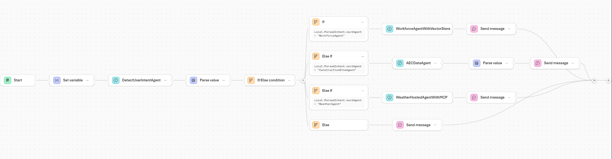

# Microsoft Foundry Workflows

This folder contains YAML workflow definitions for orchestrating multiple Foundry Agents.

## Overview

Microsoft Foundry Workflows enable declarative multi-agent orchestration for complex scenarios like:

- **Workforce Dispatch Flow**: Coordinates intent detection → Workforce Agent / Fabric Data Agent / Weather Agent
- **Intent-Based Routing**: Uses an intent detection agent to route queries to the appropriate specialized agent
- **Human-in-the-Loop (HITL)**: Supports conversation flows with user interaction

## Workflow Diagram



## Workflow Files

| File | Description |
|------|-------------|
| `foundry-workflow.yaml` | Main workflow with intent detection and multi-agent routing |
| `foundry-workflow-diagram.png` | Visual diagram of the workflow |

## Workflow: HITL-With-Intent-Detection

This workflow implements intelligent routing of user queries to specialized agents based on detected intent.

### Flow Overview

1. **Start** → Capture user message
2. **DetectUserIntentAgent** → Analyzes user input and determines which agent should handle the request
3. **Parse Value** → Extracts the `nextAgent` field from the intent result
4. **If/Else Condition** → Routes to the appropriate agent:
   - `WorkforceAgentWithFoundryIQ` → For workforce availability and skill queries
   - `ConstructionSiteAgent` (AECDataAgent) → For site alerts and device data queries
   - `WeatherAgent` (WeatherHostedAgentWithMCP) → For weather and safety gear queries
5. **Send Message** → Returns the agent response to the user

### Agents Used

| Agent | Purpose |
|-------|---------|
| `DetectUserIntentAgent` | Classifies user intent and routes to appropriate agent |
| `WorkforceAgentWithVectorStore` | Queries Foundry IQ for workforce skills and availability |
| `AECDataAgent` | Queries Microsoft Fabric for real-time device/site data |
| `WeatherHostedAgentWithMCP` | Provides weather data and safety recommendations via MCP |

### Intent Detection Routing

The `DetectUserIntentAgent` returns a JSON object with a `nextAgent` field:

```json
{
  "nextAgent": "WorkforceAgent"  // or "ConstructionSiteAgent" or "WeatherAgent"
}
```

### Example Routing

| User Query | Detected Intent | Routed To |
|------------|-----------------|-----------|
| "Find crane operators available this week" | WorkforceAgent | WorkforceAgentWithVectorStore |
| "Any critical alerts at the PA site?" | ConstructionSiteAgent | AECDataAgent |
| "What safety gear for Chicago site today?" | WeatherAgent | WeatherHostedAgentWithMCP |

## Deploying the Workflow

1. Import the YAML workflow into Microsoft Foundry
2. Configure the Azure Agent connections for each agent
3. Deploy the workflow
4. Test with sample queries

## Related Documentation

- [Microsoft Foundry Workflows](https://learn.microsoft.com/azure/ai-foundry/)
- [Azure AI Foundry Agents](https://learn.microsoft.com/azure/ai-foundry/agents/)
